<p align="center">
  <picture>
    <source media="(prefers-color-scheme: dark)" srcset="docs/assets/readme/logo-star-white.svg">
    
  </picture>
</p>

<h1 align="center">Orion</h1>

<p align="center">
  A small voice assistant for your desk that you put together yourself.<br>
  Say "Orion", ask in Arabic or English, and it answers out loud.
</p>

<p align="center">
  <a href="LICENSE"></a>
  <a href="https://github.com/MultiX0/orion/releases/latest"></a>
  <a href="https://github.com/MultiX0/orion/actions/workflows/ci.yml"></a>
</p>

<p align="center">
  <a href="https://www.joinorion.io"><b>joinorion.io</b></a>
</p>

<p align="center">
  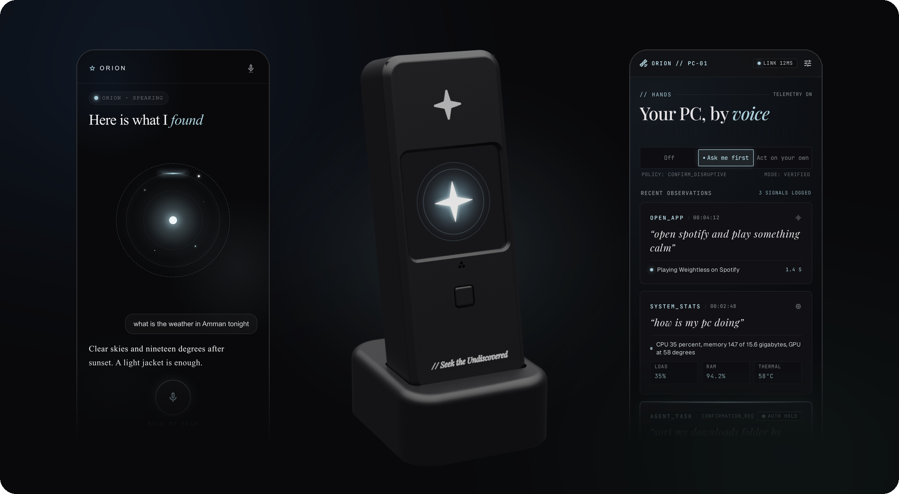
</p>

## Get Orion running

You do not need to write code or install developer tools. Three steps:

**1. Get the board.** Orion runs on the [LilyGO T-CameraPlus-S3](https://lilygo.cc/products/t-camera-plus-s3). You also need a USB-C cable that carries data (not a charge-only one). The [printed case](#the-case) is optional.

**2. Put Orion on it.** Connect the board to your computer with the cable, then:

- **Windows 10 or 11:** download [`flash-orion.bat`](tools/install/flash-orion.bat) (on that page, use the download button at the top right of the file) and double-click it. That one double click is the whole install. If Windows says it protected your PC, choose *More info*, then *Run anyway*.
- **Linux or macOS:** open a terminal and paste the line below. macOS is supported by the same script but has been tested less than Linux.

  ```
  bash <(curl -fsSL https://raw.githubusercontent.com/MultiX0/orion/main/tools/install/flash-orion.sh)
  ```

The installer finds the board, gets Espressif's flashing tool, downloads the latest Orion firmware, checks it against the release's checksum, and writes it. You do not need Python: when it is missing, the installer uses the standalone esptool that Espressif publishes. It takes a few minutes and needs no admin rights. If it cannot find the board, try another cable, or hold the **BOOT** button on the side of the board, tap **RST**, let go of BOOT, and run it again. More in [tools/install](tools/install/README.md).

**3. Open the app.** Get the Orion app for [Android or Windows](https://github.com/MultiX0/orion/releases/latest) and tap *Find my Orion*. The app finds the board over Bluetooth, gives it your Wi-Fi, and asks for two keys:

- a [Fish Audio](https://fish.audio/app/api-keys/) key, for Orion's voice and hearing,
- a key for the model that does the thinking. [DeepInfra](https://deepinfra.com) is the default; any OpenAI-compatible provider works.

When the board shows its idle screen, say **"Orion"**.

## What Orion is

Orion is a voice assistant that lives on a small board with a screen, a camera, a microphone and a speaker. It listens for its name on the board itself, so nothing leaves your home until you call it. Then it hears your question, thinks, and speaks the answer, in Arabic or English, in its own voice.

It works on its own once it is set up: plug it into any USB charger and it is ready. Leave the Orion app open on your PC or phone and it can do more: open apps, play music, look things up on the web, check how your computer is doing, and remember what you talked about.

Things you can say:

- "Orion, what's the weather in Amman tonight?"
- "Orion, what do you see?" (it takes a picture with its camera and describes it)
- "Orion, open Spotify and play something calm."
- "Orion, how is my PC doing?"
- "أوريون، احسب ١٢٨ ضرب ٤٦"
- "أوريون، شو هاد؟"

## Features

**On the board**
- A custom wake word, "Orion", trained for Arabic and English speakers and run on the board with TensorFlow Lite Micro.
- Speech in and out through [Fish Audio](https://fish.audio), in Orion's own voice. Any OpenAI-compatible speech endpoint can be used instead.
- Answers stream: Orion starts speaking the first sentence while the rest is still being written.
- A camera it can look through when you ask what it sees.
- A 240x240 touch screen with an animated orb for listening, thinking and speaking, a push-to-talk button, and a menu for Wi-Fi setup and factory reset.
- Works with any OpenAI-compatible model: DeepInfra, OpenAI, Anthropic, Groq, OpenRouter, Ollama on your own network, or a custom endpoint.

**With the app**
- Setup over Bluetooth, with each key checked against the real service before it is saved. A board that is already on your Wi-Fi pairs over the network with a six digit code from its screen.
- Talk or type to Orion, watch its camera live, and read past conversations.
- **PC control on Windows:** open and close apps, control media, read system stats, take a screenshot and describe it, find files, search the web. Bigger multi-step jobs go to [DeepSeek Harness](https://github.com/deepseek-ai/deepseek-harness), an agent that works in a sandbox folder.
- Three levels of trust for the PC: off, ask me first, or act on your own. Every action is logged.
- **Phone as a helper:** with the app open, Orion can open links and apps on your phone.
- Memory: with the PC app connected, Orion remembers recent turns and what it did, so "pause it" knows what "it" is.

**Privacy**
- The wake word runs on the board. Audio goes out only after you say "Orion".
- No Orion account, no Orion cloud, no subscription. Nothing passes through a server of ours.
- Keys live in the board's own storage and in your system keychain, and are sent only to the board you paired with and the services they belong to.

## How it works

A single voice turn:

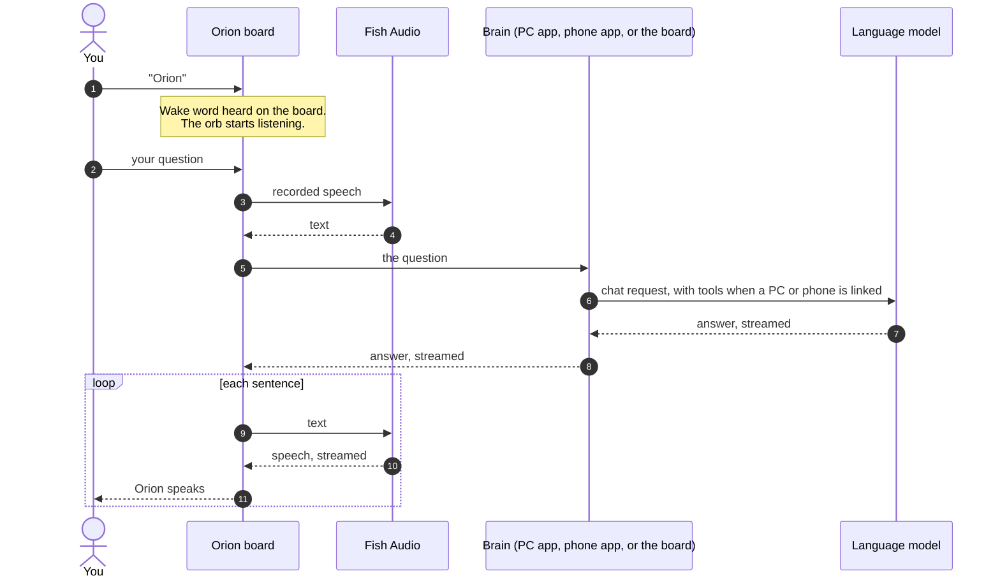

The brain is whichever is available first: the PC app when PC control is on, then a linked phone, then the board itself calling the model directly. The PC and phone add tools, the web, the time and a memory of the conversation; the board alone can still answer anything the model knows and look through its camera.

More detail in [docs/ARCHITECTURE.md](docs/ARCHITECTURE.md), [docs/DEVICE_PROTOCOL.md](docs/DEVICE_PROTOCOL.md) and [docs/HARNESS.md](docs/HARNESS.md).

## The hardware

<p align="center">
  
  
</p>
<p align="center"><sub>Photos by LilyGO, from the <a href="https://github.com/Xinyuan-LilyGO/T-CameraPlus-S3">T-CameraPlus-S3 repository</a>.</sub></p>

Orion is written for the LilyGO T-CameraPlus-S3. Everything it needs is on the one board:

| Part | On the board |
|---|---|
| Processor | ESP32-S3, dual core, Wi-Fi and Bluetooth LE |
| Memory | 16 MB flash, 8 MB PSRAM |
| Screen | 1.3 inch 240x240 (ST7789) with capacitive touch (CST816) |
| Camera | OV2640 |
| Microphone | MP34DT05 digital microphone |
| Sound | MAX98357 amplifier and a small speaker on the Audio socket |
| Power | USB-C, with a battery charger (SY6970) |
| Buttons | Push-to-talk on the front, BOOT and RST on the side |

Buy it from [LilyGO](https://lilygo.cc/products/t-camera-plus-s3). Board documentation and schematics are in [LilyGO's repository](https://github.com/Xinyuan-LilyGO/T-CameraPlus-S3). Flashing, updating and resetting are covered in [docs/FIRMWARE.md](docs/FIRMWARE.md).

## The case

<p align="center">
  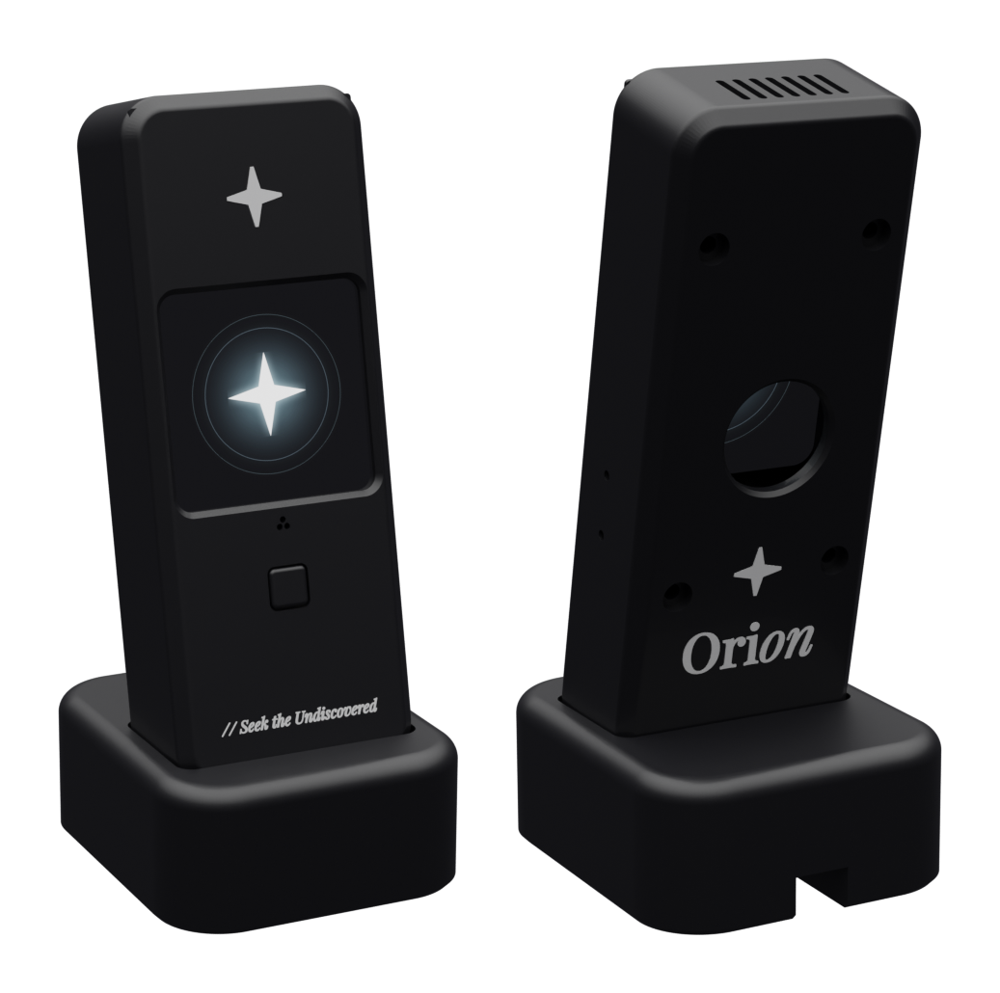
</p>

A two-part case with a desk stand, made for version 1.2 of the board. The screen sits behind a thin lip, the push-to-talk button gets its own plunger, the microphone and speaker have sealed channels, and the Wi-Fi antenna has a pad of its own. White star and wordmark inlays finish the front and back.

<p align="center">
  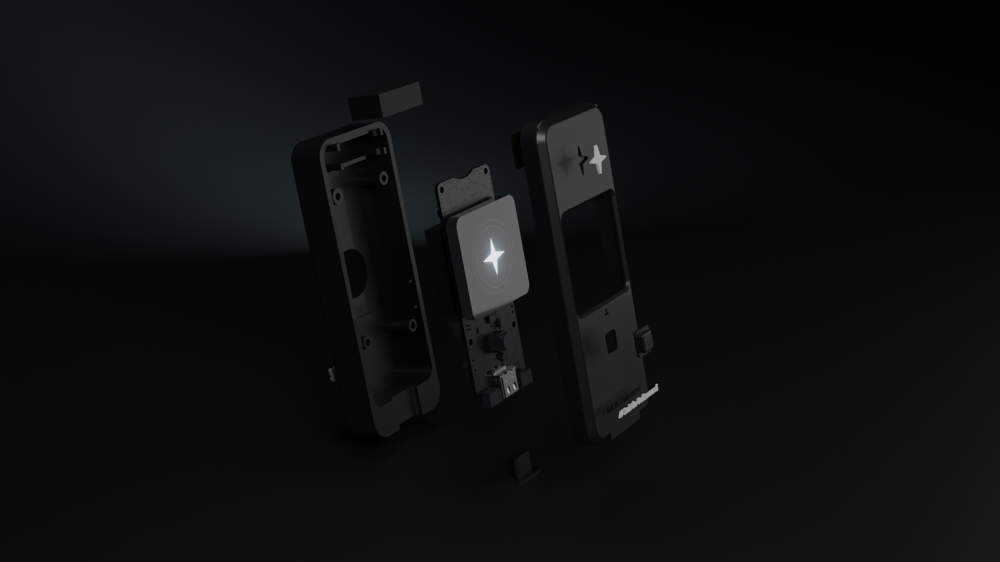
</p>

> **Heads up:** the measurements of the 3D case model are not fully accurate yet, and we are working on a fix. Print the two small fit-test parts in [`case/fit_test`](case/fit_test) first and check the fit on your board before you print the whole case.

- Print in PLA or PETG, 0.2 mm layers, no supports. Never use carbon fibre, metal-filled or conductive filament: it blocks Wi-Fi.
- STL files are in [`case/stl`](case/stl). A multi-colour printer can use [`case/orion_case.3mf`](case/orion_case.3mf), which has the white logos in place.
- You also need four M2 x 16 self-tapping screws and four small rubber feet.

Dimensions, print settings and assembly order: [case/SPEC.md](case/SPEC.md). The whole case is generated from [`case/cad/params.py`](case/cad/params.py), so a measurement change is one edited number.

## The app

One Flutter app for Android and Windows. It sets the board up, shows what Orion is doing, and on Windows lets Orion use your PC.

<p align="center">
  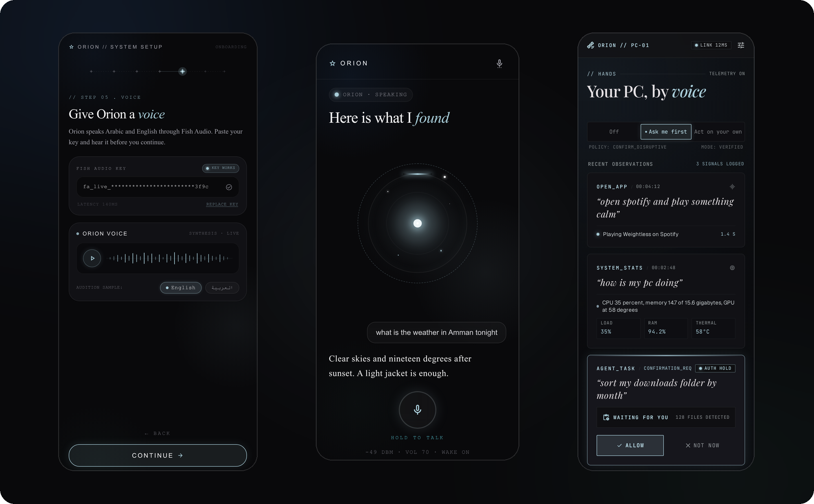
</p>

From the app itself:

| | |
|---|---|
| 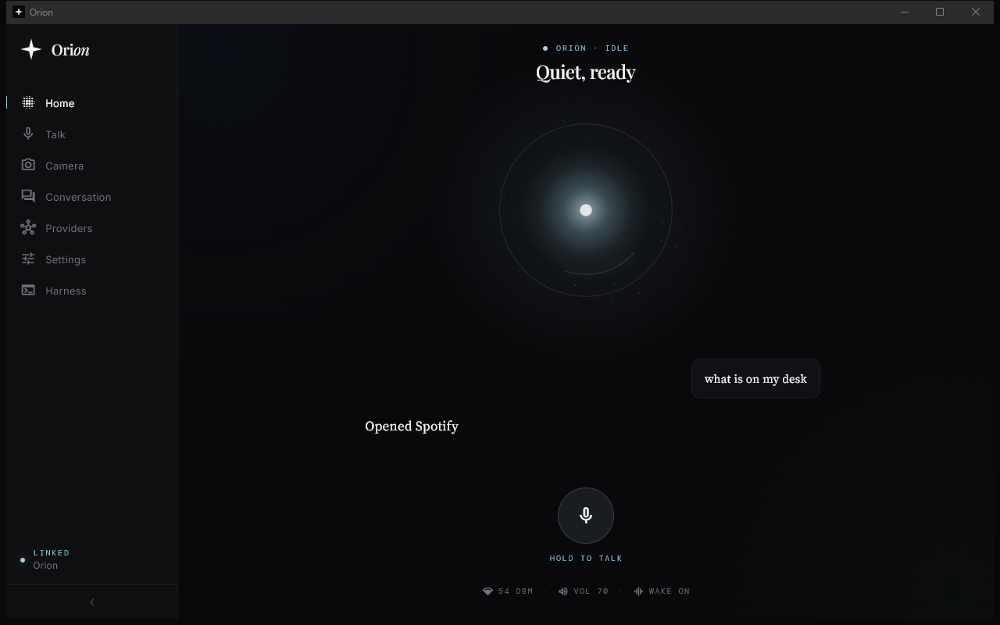 | 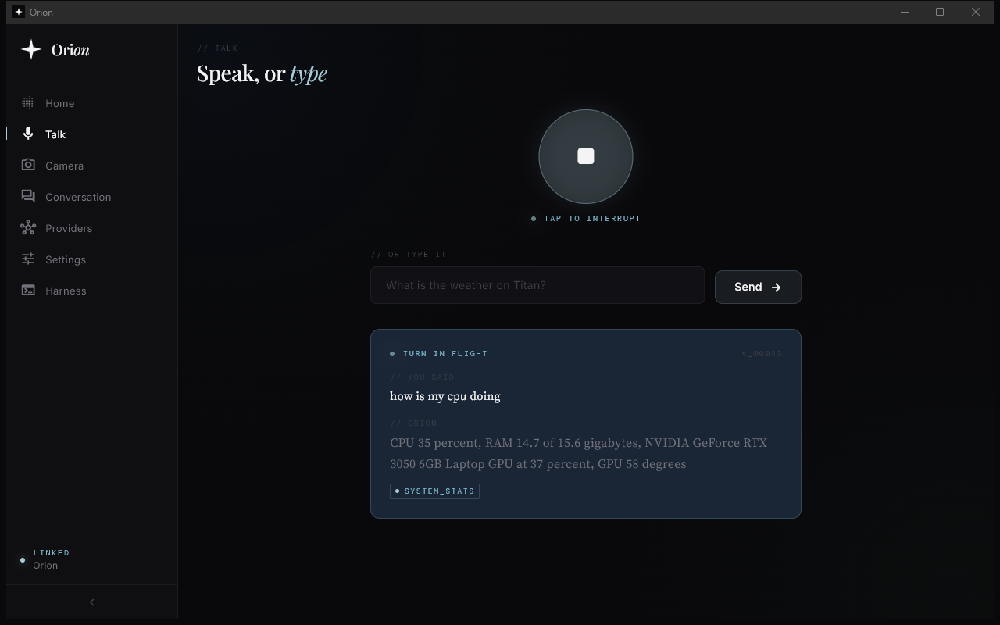 |
| 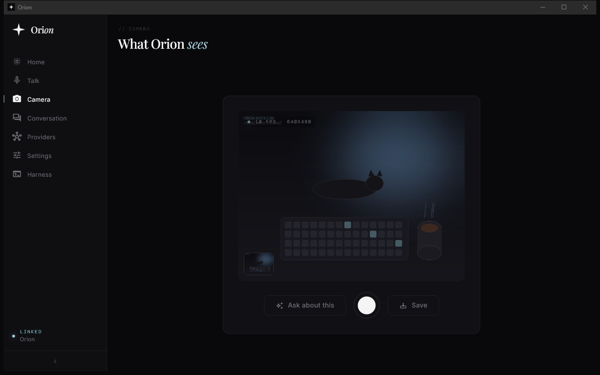 | 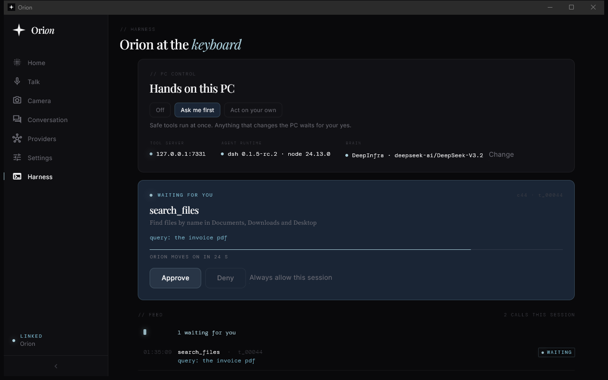 |

<p align="center">
  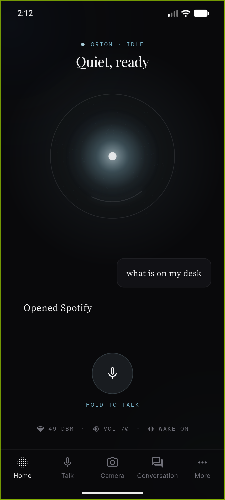
  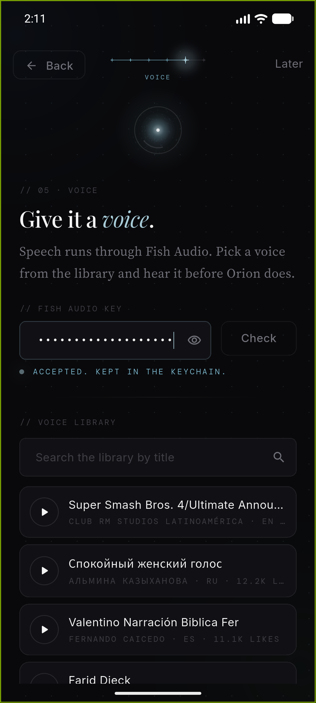
  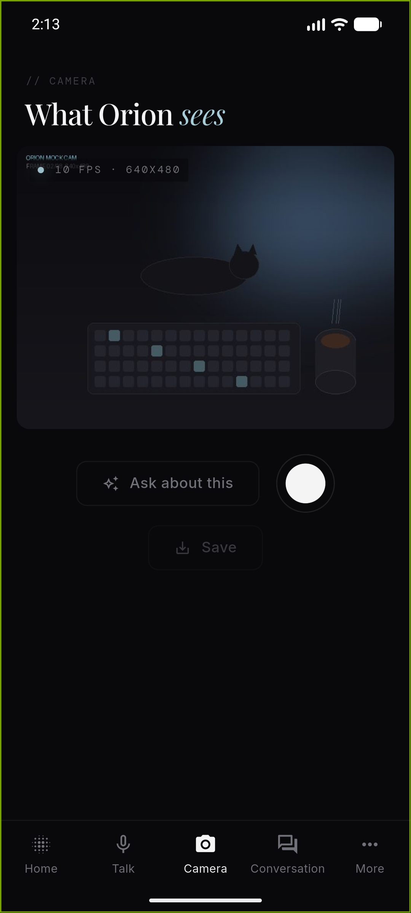
  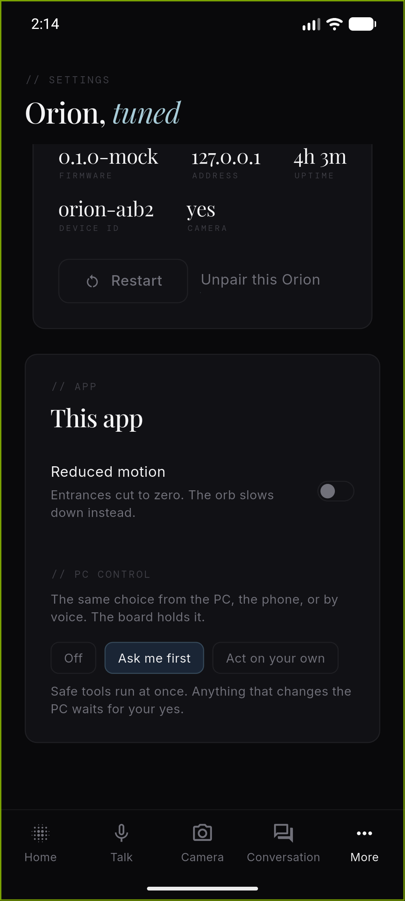
</p>

## Building from source

Most people never need this; the installer and the app releases cover everything. If you want to change Orion:

| Part | What you need | Start here |
|---|---|---|
| App | Flutter stable | `flutter pub get`, `dart run build_runner build --delete-conflicting-outputs`, `flutter run`. No board yet? `dart run tool/mock_device/main.dart` runs a pretend one. iOS is set up in the same code but has not been built or tried on a device yet, so there is no iOS release. |
| Firmware | ESP-IDF v5.5.5 | `idf.py build` in `firmware/`. See [docs/FIRMWARE.md](docs/FIRMWARE.md). |
| Wake word | Python, WSL2 on Windows | [wakeword/README.md](wakeword/README.md) |
| Case | Python with build123d, Blender for renders | [case/SPEC.md](case/SPEC.md) |

Further reading: [docs/ARCHITECTURE.md](docs/ARCHITECTURE.md) for how the app is organised, [docs/PROVIDERS.md](docs/PROVIDERS.md) for model and voice settings, [docs/UI.md](docs/UI.md) and [brand/](brand/README.md) for the look, and [docs/CODE_STYLE.md](docs/CODE_STYLE.md) for how code is written here.

## Contributing

Bug reports, ideas and pull requests are welcome. Open an issue first for anything large, so we can agree on the shape before you spend time on it. For code, follow [docs/CODE_STYLE.md](docs/CODE_STYLE.md), and for the app run `flutter analyze` and `dart format .` before you send it. By contributing you agree that your work is shared under the same license as the rest of Orion.

## License

Orion is free for personal and non-commercial use. You can build it, change it, share it, and use it at home, in school, in research, or in a charity. You cannot sell it, or use it in a commercial product or service, without the author's permission.

The terms are the [PolyForm Noncommercial License 1.0.0](LICENSE). If you pass Orion on, pass on that file with its `Required Notice` line. Because commercial use is excluded, Orion is source-available rather than open source in the OSI sense: all of the source is public to read, build and learn from.

Parts made by others keep their own licenses: ESP-IDF, LVGL, TensorFlow Lite Micro, microWakeWord and the `okay_nabu` wake word model, the Flutter packages, and the fonts (Playfair Display, Source Serif 4, Inter and DM Mono, under the SIL Open Font License). The board photos above belong to LilyGO.

## Credits

Orion is made by **MultiX0**: [github.com/MultiX0](https://github.com/MultiX0). The project's website is [joinorion.io](https://www.joinorion.io).

Thanks to [LilyGO](https://lilygo.cc) for the board, [Espressif](https://www.espressif.com) for the ESP32-S3 and its tools, [Fish Audio](https://fish.audio) for the voice, [DeepInfra](https://deepinfra.com) for the default models, and the people behind [microWakeWord](https://github.com/OHF-Voice/micro-wake-word), [LVGL](https://lvgl.io) and [Flutter](https://flutter.dev).
