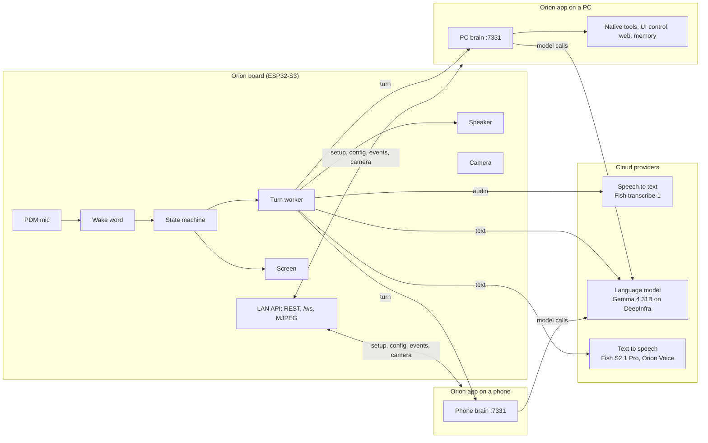
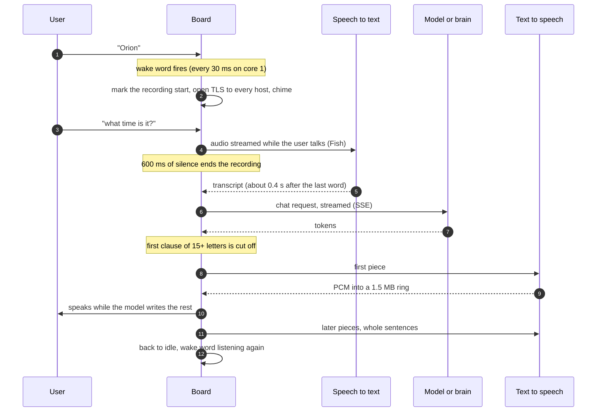
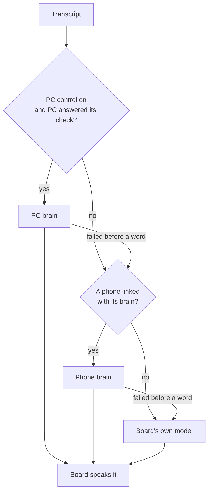
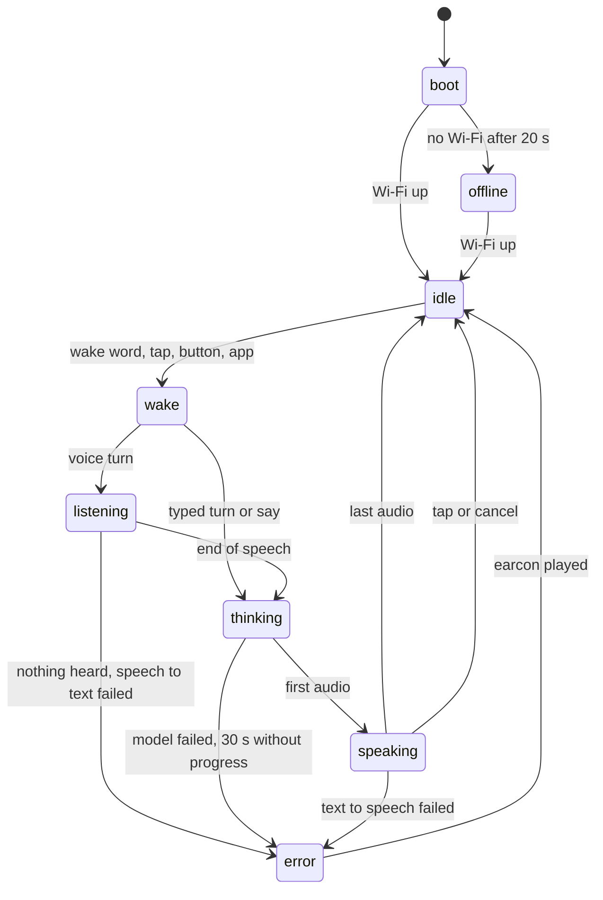
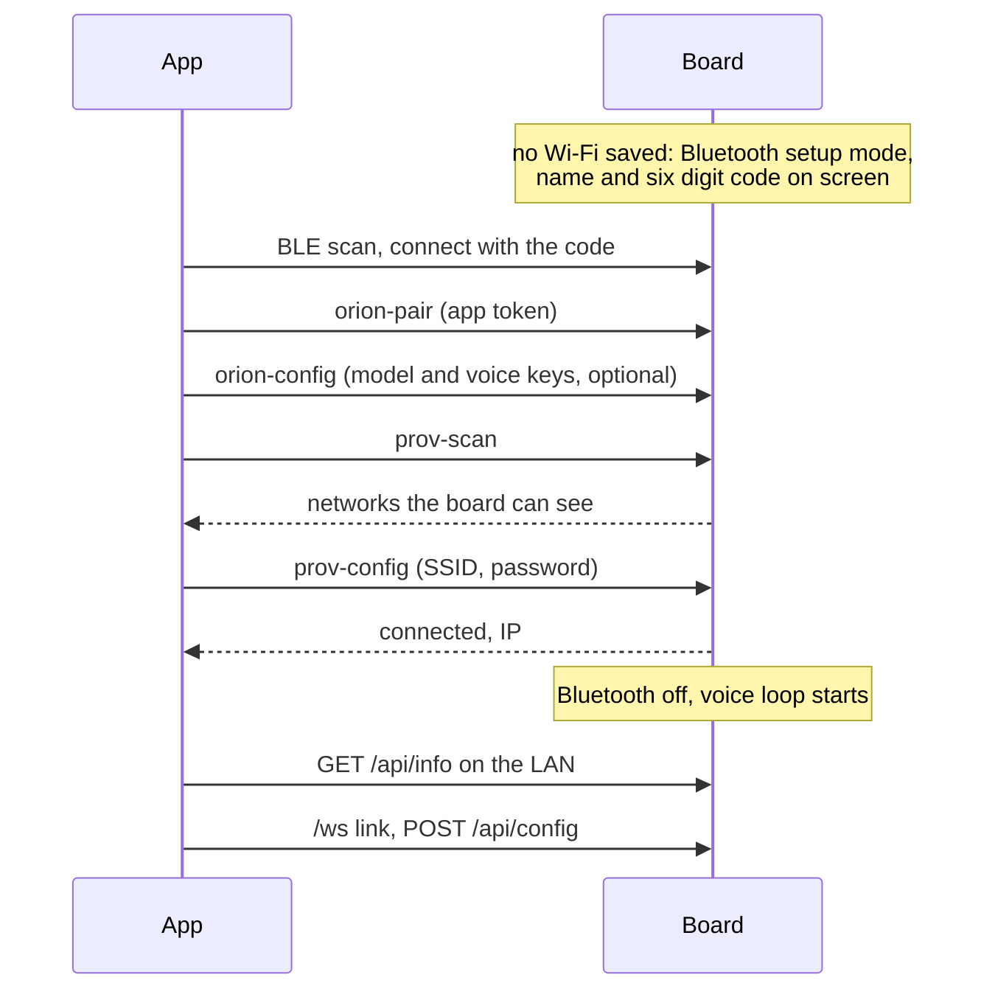

# Architecture

Orion is a voice assistant that lives on a small board. The board hears its name, records the question, sends it to speech to text, hands the words to a language model, speaks the answer through a text to speech voice, and shows what it is doing on its screen. It needs nothing but Wi-Fi to do that.

A companion app, one Flutter codebase for Android, iOS and Windows, sets the board up and watches it. When the app is running on a PC or a phone and linked to the board, it also becomes an extended brain: the board sends its turns there, and the app answers with the date and time, the web, a memory of the conversation and, on a PC, real control of the computer. The board stays the voice either way.

## The pieces



| Piece | Where | What it does |
|---|---|---|
| Firmware | `firmware/` | ESP-IDF 5.5.5 project for the LilyGO T-CameraPlus-S3 V1.2. Wake word, audio, screen, camera, Wi-Fi and Bluetooth setup, the LAN API, and the whole cloud voice loop. See [FIRMWARE.md](FIRMWARE.md). |
| Wake word | `wakeword/`, flashed from `firmware/components/orion_wakeword/models/` | A custom microWakeWord model for "Orion", trained for Arabic and English speakers. See [WAKEWORD.md](WAKEWORD.md). |
| App | `lib/`, `android/`, `ios/`, `windows/`, `linux/` | Setup, dashboard, remote, live camera, model and voice choice, and the extended brain. See [APP.md](APP.md). |
| Harness | `lib/features/harness/` | The PC side: tool server, PC brain, native tools, approvals, the optional agent runtime. See [HARNESS.md](HARNESS.md). |
| Voice | `firmware/assets/`, `voice/` | Orion Voice on Fish Audio, the system prompt, the earcons. See [VOICE.md](VOICE.md). |
| Case | `case/` | The 3D printed enclosure and stand. See [CASE.md](CASE.md). |
| Tools | `tools/`, `tool/` | Build, flash, serial, provisioning and measurement scripts for the board (`tools/`); the mock board and the harness utilities for the app (`tool/`). |

## A voice turn

This is what happens between "Orion, what time is it?" and the answer.



Step by step, with the numbers measured on the board:

1. **Wake.** The wake word model runs on the microphone stream all the time. When it fires, the board marks that moment as the start of the recording (so "Orion, what time is it" in one breath keeps its first word), starts opening TLS connections to every cloud host in the background, and plays the short chime with the microphone still open.
2. **Listen.** The recorder starts on the first speech after the mark, keeps 300 ms before it, and ends after 600 ms of silence (10 s at most). With Fish as speech to text, the audio is uploaded as chunked multipart while the user is still talking, so only the last piece is left to send when they stop. Transcript arrives about 0.4 s after the last word.
3. **Think.** The transcript goes to the first brain that is up: the PC, a linked phone, or the board's own model (see below). The reply streams back as SSE.
4. **Speak.** A chunker cuts the reply at the first clause of at least 15 speakable characters, then at whole sentences of at least 40. Each piece is synthesized by the text to speech worker while the model is still writing the next one, into a 1.5 MB PCM ring in PSRAM that the speaker drains. Voice cues like `[laugh]` travel with their words and are performed by the voice, never read.
5. **Done.** The board logs one line with every stage's timing, returns to idle, and the wake word listens again.

Measured, from the last spoken word to the first sound of the answer: **2.4 to 2.9 s** on the default path (Fish streaming speech to text 0.4 s, first model token 0.4 to 0.6 s, first audio from Fish about 0.5 s). A typed question from the app to first audio: **1.1 to 1.6 s**. Before the latency work the same spoken turn took 4.6 to 17 s; the fixes are in [FIRMWARE_CLOUD.md](FIRMWARE_CLOUD.md).

A tap on the screen or a press of the side button starts the same turn without the wake word. A tap while Orion is talking stops it; there is no barge-in by voice, since there is one microphone and no echo cancellation.

## Where the answer is written



- The **PC brain** runs in the Orion app on Windows when PC control is on. It answers with the provider and model chosen in the app, adds the PC's name, date, time and time zone, searches the web, checks the weather, remembers the last turns and what it did, and can open, close and work any app on the PC. Risky actions wait for approval unless the user chose "act on your own".
- The **phone brain** runs in the Orion app on a phone while it is open and linked. Same brain, same model choice, with the web, the date and a memory, and one tool: opening a link or an app link on the phone.
- The **board's own model** answers when neither is there. It is told, for that turn, that no PC or phone is connected (or that the connected one did not answer), so it never claims to have done something it cannot reach.

The board checks the PC with `GET /tools` at every wake and every 40 s, with a 3 s timeout. A brain that fails before any words were spoken hands the same turn to the next one. The protocol details are in [DEVICE_PROTOCOL.md](DEVICE_PROTOCOL.md#board-to-brain).

### A fast model to answer, a thinking model to act

Inside the PC and phone brains, a turn starts on the fast model (Gemma 4 31B turbo by default). If the turn only needs an answer or a look-up (web search, weather, reading a page, the list of open windows, system stats, reading an app's controls), it finishes there, 1.5 to 6 s to the first word. The moment the fast model tries to act on the PC or phone, that round is dropped unrun and the turn moves to the thinking model (GLM 5.3 Flash by default), which plans the task itself with a larger budget. The board hears "One moment, I'm on it." and padded keep-alives while it works, so its 30 s deadline, which counts from the last sign of life, never runs out.

Why two models: in real tasks the fast model reported success it never checked (it said a cover was The Weeknd's original, and read out a Calculator result that was not on the screen). It stays because it answers quickly, sees pictures and speaks good Arabic. The measurements that chose both are in [HARNESS.md](HARNESS.md#choosing-the-models-a-fast-one-to-answer-a-thinking-one-to-act).

## The board's states



One task owns the state (`orion_sm`); everything else, the wake word, the button, the touch screen, Wi-Fi, the turn worker and the LAN API, only posts events to it. That same task makes every screen call, so the UI is never entered from two places at once. Offline still listens for the wake word, so a wake gets the offline earcon and the user learns why nothing happened.

## Setting up a board



A board that is already on the network pairs with a code instead: the app asks, the board shows six digits for two minutes, the user types them. Up to four apps stay paired, so a phone and a PC can both hold the board. Details in [DEVICE_PROTOCOL.md](DEVICE_PROTOCOL.md#pairing).

## Where secrets live

- **On the board**, only in NVS: Wi-Fi password, provider keys, paired app tokens, the PC token. Nothing is compiled into any firmware image, so release binaries can be shared. The API never returns a key, only its last four characters. Logs report a key by length, never by value.
- **In the app**, only in the OS keychain (`flutter_secure_storage`): the pairing token and every provider key. They never go into the settings file, a URL, a log line or a toast. They reach the board through `POST /api/config` or the encrypted Bluetooth session.
- **For development**, in `.env` at the repo root, which is gitignored. `tools/cloud/provision.py` writes it into the board's NVS partition and deletes the temporary image.

## Internal RAM is the constraint

The ESP32-S3 has about 512 KB of internal SRAM and this board adds 8 MB of quad SPI PSRAM. Wi-Fi buffers, DMA, the screen's draw buffers and task control blocks must live in internal RAM, and once Wi-Fi, the screen, the camera, the wake word and TLS all run together, internal RAM is what runs out first. The whole firmware is shaped by that:

- Wi-Fi starts first at boot. When it came after the screen, camera and wake word, `esp_wifi_init` failed with `ESP_ERR_NO_MEM` for lack of DMA capable memory.
- TLS buffers live in PSRAM (`CONFIG_MBEDTLS_EXTERNAL_MEM_ALLOC`), and AES runs in software (`CONFIG_MBEDTLS_HARDWARE_AES=n`): hardware AES needs internal DMA bounce buffers per record, and mid turn there were none left ("esp-aes: Failed to allocate memory").
- LVGL allocates from PSRAM through its own allocator, and its task stack is in PSRAM. That gave back about 34 KB.
- The cloud workers, the HTTP server, the camera stream and the mDNS task keep their stacks in PSRAM. Because a task with a PSRAM stack must never touch flash (flash reads switch off the cache), every setting those tasks need is read once into RAM, and every NVS write is handed to a task with an internal stack.
- The Bluetooth controller runs from flash (`CONFIG_BT_CTRL_RUN_IN_FLASH_ONLY`), which saves about 16 KB of IRAM, and its memory is released at boot when setup mode does not run.
- Speech to text and text to speech share one kept-alive connection when they are on the same host; a third TLS session cost about 4 KB of internal RAM.

With all of it running, a board has roughly 27 to 41 KB of internal RAM free after a turn. Every new buffer goes to PSRAM unless it truly cannot.

## Repository layout

```
firmware/        ESP-IDF project: main/ and components/, partitions, assets
wakeword/        wake word training scripts, models and test clips
lib/             Flutter app: app/, core/, features/<feature>/{domain,data,presentation}
test/            app tests, mirrors lib/
tool/            mock board, harness utilities, brain eval (Dart)
tools/           board build, flash, serial, provisioning, cloud measurement scripts
voice/           voice auditions and their records
case/            3D printed case: CAD, Blender, print files, renders
brand/           colours, type, motion, logo, voice: the design source for app and board
harness/dsh/     notes on the optional agent runtime
docs/            this documentation
```
