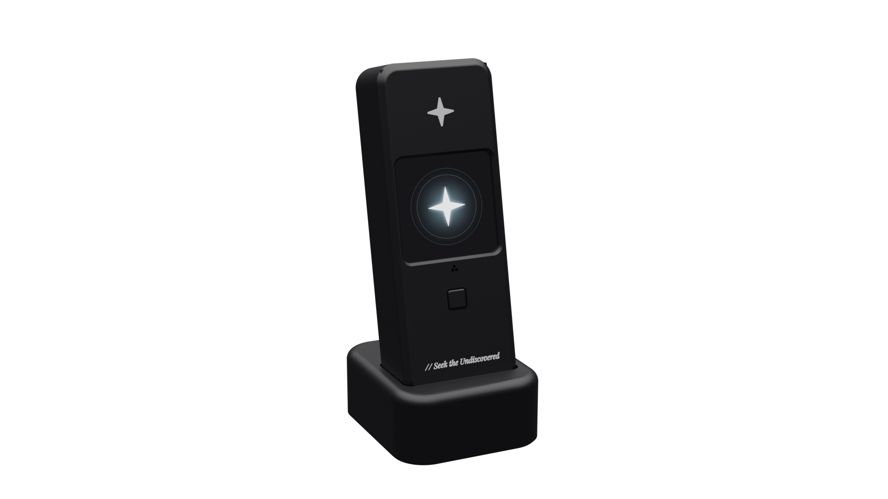
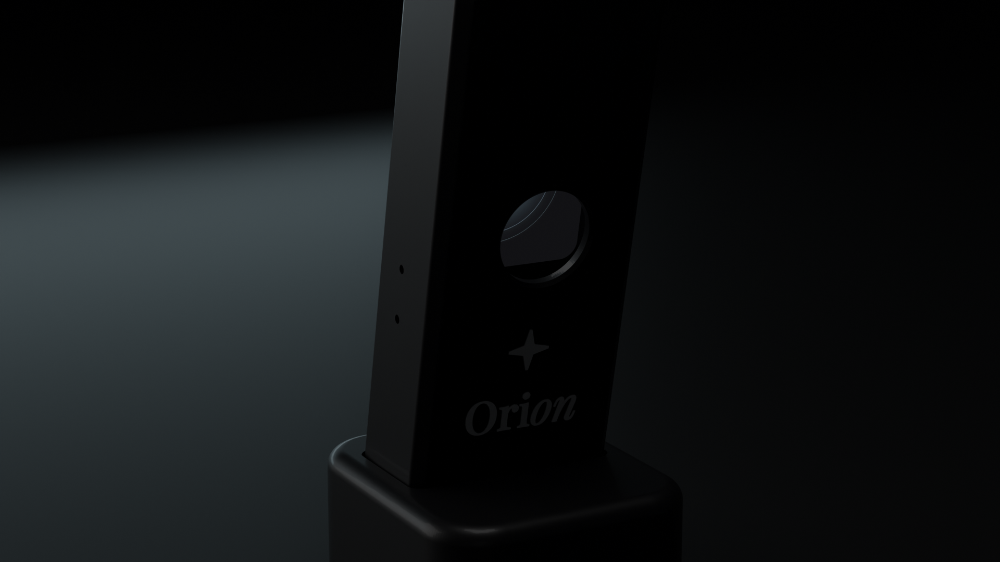

# The case

A two-part 3D printed enclosure for the LilyGO T-CameraPlus-S3 V1.2, with a desk stand, a push to talk button, a sealed microphone channel, a sealed speaker pocket and a pad for the Wi-Fi antenna. Everything is generated from one parameter file, so a changed measurement is one edited number and a rebuild.

> **Heads up:** the measurements of the 3D case model are not fully accurate yet, and we are working on a fix. Print the fit test parts in [`case/fit_test`](../case/fit_test) first and check the fit before printing the whole case.



|  |  |
|---|---|

Assembled, the case is about 36.4 x 96 x 20.4 mm. The stand is 46 x 53 x 21 mm, and with the case in it Orion stands about 110 mm tall, leaning back 12 degrees.

The full specification, with every dimension and its source, the clearances, the assembly order and the caliper checklist, is [`case/SPEC.md`](../case/SPEC.md). This page is the overview.

## Before you print

- **The camera faces away from the screen.** On this board the camera is on the back. With the screen facing you, Orion sees what is behind the device, never your face. The stand is symmetric, so the case also sits the other way round: camera toward you, screen away.
- **Two sizes are estimates.** LilyGO's official STEP model of the V1.2 board has no screen and no camera in it. Their sizes are marked PROV in `case/cad/params.py` and `case/SPEC.md`. Print the fit test first (`case/fit_test/fit_coupon.stl` and `screen_frame.stl`) and check the screen, the lens, the speaker and the antenna with calipers.

## The parts

| File | Colour | Print | Notes |
|---|---|---|---|
| `case/stl/front_bezel.stl` | black | front face down | the screen window, the button hole, the mic holes, the star, the tagline |
| `case/stl/rear_shell.stl` | black | back face down | camera opening, speaker crown, the Ori*on* wordmark, screw heads |
| `case/stl/button_plunger.stl` | black | flange down | presses IO17, the push to talk button |
| `case/stl/stand.stl` | black | bottom down, 40 % infill | holds the case at 12 degrees; the USB-C cable comes up through it |
| `case/stl/dock.stl` | black | bottom down | optional, only with a 10 cm USB-C male to female extension |
| `case/stl/inlay_star.stl`, `inlay_star_back.stl`, `inlay_orion.stl` | white | flat | 0.8 mm, glued into their pockets |
| `case/stl/inlay_tagline.stl` | white | flat | 0.6 mm, "// Seek the Undiscovered"; resin or a 0.2 mm nozzle |
| `case/orion_case.3mf` | both | as placed | multi-material: the shells with the white fills in their pockets |

Material PLA or PETG. **Never carbon fibre, metal filled or conductive filament**: they detune the Wi-Fi antenna inside the case. Nozzle 0.4, layers 0.2, 5 perimeters (2 mm walls), 5 top and bottom layers, 20 % infill for the shells. No supports on any part: no overhang is steeper than 45 degrees except flat ceilings, the widest of which is 8.5 mm.

On a single-nozzle printer, print the white inlays separately and glue them in; a layer colour change will not work, because both branded faces print face down. On a multi-colour printer, use the 3MF and give the parts named `fill_...` white.

To order from a print service, send one STL per part in millimetres with the material, colour, quantity, layer height and infill for each; the shop decides orientation and slicing. Do not send a STEP: the logo pockets exist only in the meshes.

## Hardware

- 4 x M2 x 16 pan head self-tapping screws (head 3.8 to 4 mm), from the back through the rear standoffs and the PCB into 1.6 mm pilots in the front bosses. Heat-set inserts do not fit: the speaker socket leaves only 4.2 mm for the boss at one hole.
- 4 rubber feet, 8 mm across, up to 1.5 mm thick, under the stand.
- The speaker (FUET FS2112, 20.8 x 11.8 x 7 mm) and the board's FPC antenna.

## Design decisions

- **Walls 2 mm**, and the inner cavity set by the 32 mm screen glass, which overhangs the 28 mm board on both sides.
- **Parting plane at the top of the PCB.** The bezel prints face down and the rear shell back down, with no supports, and the four screws through the PCB align the halves (a tongue and groove came out 0.85 mm thin and was dropped).
- **The microphone seal sits on the mic's lid**, around its top port, not on the PCB: small resistors sit 0.27 mm from the mic body, leaving no room for a ring on the board. Three 0.9 mm holes in the front lead to it.
- **The speaker fires up** from a crown at the top, on the opposite face and 50 mm from the microphone, pressed against a 0.5 mm rim around its opening and held by crush ribs and two hooks. The grille is seven 1.1 mm slots, 46 percent open.
- **The antenna** sits on a flat pad inside the front wall above the screen: past the end of the PCB's ground plane, away from the screen and the camera, with no screw within 5 mm.
- **USB-C at the bottom** needs about 20 mm under the case for a straight cable, so the stand carries it: the case's neck sits 8 mm deep in a pocket tilted 12 degrees, the cable comes up through the stand and leaves through a groove at the back. The USB channel is straight through the wall at the connector's full overmold size; a lip to hide the two QWIIC ports beside it stopped a normal plug 2.35 mm short.
- **Pinholes for RST and BOOT** on the right side, teardrop shaped so they print without support. No openings for the QWIIC ports, the battery socket, the battery switch (it disconnects a battery the case does not have) or the TF slot (the firmware never mounts a card).
- **Branding** from `brand/`: the star on the front above the screen, "// Seek the Undiscovered" small at the bottom in Playfair italic, the star over Ori*on* on the back. Case colour `#111115`, the nearest black the brand allows; logos `#F4F4F5`. Playfair's thinnest strokes are 0.02 em, far under a nozzle's width at these sizes, so every outline is grown evenly (0.12 mm on the wordmark, 0.08 mm on the tagline). The brand face was chosen over a heavier mono face that printed easily but looked cheap.

The smallest clearance in the fit check is the designed 0.2 mm of travel between the plunger and the button; next are 0.3 mm to the QWIIC connectors and cable channels. No part overlaps the board.

## Rebuilding

The solids are built in build123d (OpenCascade: real fillets, exact booleans) from `case/cad/params.py`, in a Python 3.12 environment (OCP has no wheels for 3.14):

```
case/ref/.venv/Scripts/python.exe case/cad/build_case.py
case/ref/.venv/Scripts/python.exe case/cad/marks.py
case/ref/.venv/Scripts/python.exe case/cad/export_fit.py
```

Blender (with the 3D Print Toolbox add-on) imports them next to the real board for the checks and the renders. In order: `case/blender/import_parts.py`, `branding.py`, `fit_check.py`, `print_check.py`, `export_print.py`, then `render_setup.py` and `render_heroes.py`. `case/blender/build_scene.py` does the scene build and renders headless (`blender -b --factory-startup -P case/blender/build_scene.py`) and saves `case/orion_case.blend`. The reports are `case/blender/fit_report.txt` and `print_report.txt`.

The board model comes from LilyGO's STEP file, converted by `case/ref/step_to_meshes.py` into one mesh per part (`case/ref/board_v1.2_parts.glb`) and measured by `case/ref/measure_board.py`. The 68 MB STEP is not in the repository: `3D_PCB_T-CameraPlus-S3_V1.2_202505091545.step` in `structure/` of github.com/Xinyuan-LilyGO/T-CameraPlus-S3.
