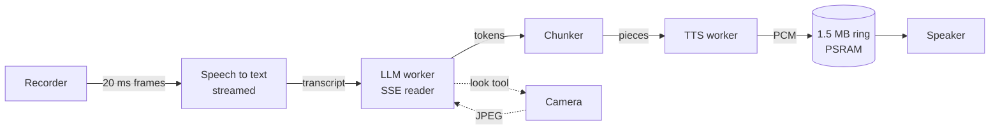

# The voice pipeline on the board

`firmware/components/orion_cloud`, driven by `firmware/main/orion_turn.c`. This is everything between the recording and the speaker: speech to text, the language model or an extended brain, the camera when a question needs it, and text to speech. Every request verifies TLS against the ESP-IDF certificate bundle.

## The shape of a turn



- `orion_turn.c` records, streams the audio to speech to text while the user talks, then calls `orion_cloud_reply`, which thinks and speaks in one call and returns when the last PCM has gone to the speaker.
- The **LLM worker** streams the chat completion over SSE and feeds a chunker. The **TTS worker** turns each piece into PCM while the model is still writing the next. The caller drains the ring into the speaker the moment it holds anything.
- `on_reply` hands the full text to the screen and the WebSocket when the model finishes, often after the first words are already playing.

## Connections

A TLS handshake costs this chip 1.5 to 3.3 s (3.1 s measured cold to DeepInfra). A turn that paid one per stage spent about six seconds on handshakes before doing any work. So:

- Each stage keeps one `esp_http_client` connection alive for the life of the program: the language model, speech to text, text to speech, the PC brain and the phone brain. A response is always read to its last byte and the socket left open; the next request on that handle goes straight out on it. (`esp_http_client_close` closes the socket, whatever its name suggests, and `esp_http_client_flush_response` left a stale length behind that crashed the next read: responses are drained with `esp_http_client_read` instead.)
- Speech to text and text to speech share one connection when they are on the same host. A turn transcribes before it replies, so they never overlap, and a third TLS session cost about 4 KB of internal RAM. The language model never shares: its stream and the speech requests overlap on every reply.
- **Prewarm.** `orion_cloud_prewarm` opens or refreshes every connection on the cloud workers and returns at once. It runs at the wake word, while the user is still talking, and when Wi-Fi comes up.
- **Heartbeat.** DeepInfra drops an idle connection after 60 to 90 s; Fish keeps one past 90 s. While idle, the board sends a `HEAD` on each kept connection every 40 s, which answers at once and keeps it open. The first question after a quiet spell went from 4.9 s to 1.7 s.
- A kept connection the server has already dropped fails fast, is replaced once, and the request is sent again from the start.
- `TCP_NODELAY` on every cloud socket. Headers and body leave as separate TLS records, and Nagle held the short last segment of each for a round trip.
- HTTP buffers are 4352 bytes, just over the 4 KB line, so they land in PSRAM.

## Speech to text

### Fish, streamed

With `stt.provider` `fish`, the recording goes up while the user is still talking:

- The request is a chunked multipart `POST https://api.fish.audio/v1/asr` with the model in the `model` header, the audio in the field `audio`, and a WAV header whose size fields say `0xFFFFFFFF` because the length is not known yet. A zero size is rejected with a 400; checked from the PC first.
- The recorder hands over everything kept so far (the pre-roll, or from the wake word mark), then every 20 ms frame, sent in 100 ms chunks.
- When the recorder hears 600 ms of silence it ends the body, and the transcript comes back about 0.4 s after the last word.
- Any failure during streaming only means the whole recording is uploaded at the end instead.

### OpenAI compatible, in one go

With `openai_compatible`, one multipart `POST <base_url>/audio/transcriptions` with `file` and `model` after the recording ends. No `language` field is sent, ever: with `language=ar` Whisper translated "What is the capital of France?" into "ما هو مدينة فرنسا؟" and Orion answered in the wrong language. A language hint also bought no accuracy in any test; it only made detection faster.

### Why Fish is the default

Every speech model DeepInfra served was measured on the same 20 clips (Levantine, mixed Arabic and English, English), three runs each, no hint:

| Model | Median | p95 | Arabic CER | Mixed CER |
|---|---|---|---|---|
| `openai/whisper-large-v3` | 4934 ms | 14756 ms | 0.179 | 0.438 |
| `openai/whisper-large-v3-turbo` | 1035 ms | 7562 ms | 0.456 | 0.768 |
| `Qwen/Qwen3-ASR-1.7B` | 599 ms | 1175 ms | 0.179 | 0.527 |
| `Qwen/Qwen3-ASR-0.6B` | 473 ms | 1328 ms | 0.284 | 0.300 |
| `mistralai/Voxtral-Mini-3B-2507` | 737 ms | 1090 ms | 0.952 | 0.797 |
| `nvidia/Nemotron-3.5-ASR-Streaming-Multilingual-0.6b` | 950 ms | 1313 ms | 0.295 | 0.613 |

Qwen3-ASR-1.7B was the clear winner and the default for a while. Then its latency from the same PC grew to 3.7 to 8.9 s median, the 0.6B model timed out, Whisper turbo heard Arabic as Romanian, and Gemma refused audio input. Fish `transcribe-1` answered the same clips in 0.46 to 0.51 s with identical words, and streaming it while the user talks leaves only about 0.4 s after the last word. That is why Fish is the default. It costs $0.36 per hour of audio.

Recognition of mixed Arabic and English is poor on every engine: English words come back transliterated (Spotify as سباتيفاي, Wi-Fi as الواي فاي). The language model absorbs most of it; it reads سباتيفاي back as Spotify and corrects its own mangled name.

## The language model

The board builds an OpenAI chat request:

- The system prompt from `/assets/system_prompt.txt` (a built-in fallback if the assets partition is missing), plus the local date and time with the part of the day spelled out, in the form "Friday 02 January 2026, 11:40 at night (23:40)". Given "23:40" alone the model said "the twenty first hour". Empty until the clock has synced.
- When the board answers itself, one more note: that no PC or phone is connected, or that the connected one did not answer, so it must not claim to have opened, closed or played anything. Asked to close Spotify with no PC, it used to say it had.
- The prompt's `<fish>` section, the voice tag rules, only when the text to speech is Fish. With any other voice the section is cut out and a line against square brackets is added instead (`cloud_prompt_refresh`, run at boot and on every reload).
- The last six exchanges, held in RAM (`CLOUD_HISTORY_TURNS`).
- The question, and the `look` tool.
- `"stream": true`, `"max_tokens": 200`, `"temperature": 0.6`.

The stream is read **128 bytes at a time**. `esp_http_client_read` does not return until it has every byte asked for or the response ends: asked for 2 KB, a short answer's first token sat in the buffer until its last one arrived. One SSE event is about 300 bytes, so 128 returns per token. Every read counts as progress and restarts the board's 30 s deadline (at most every 2 s), which is what lets a PC brain work on a task for a minute.

The SSE parser and the request writer (`cloud_sse.c`, `cloud_json.c`) do not use cJSON, whose small nodes would all land in internal RAM. They handle escaped Unicode, a tool call in the deltas and DeepInfra's final usage frame with an empty `choices`. Gemma's first-token time with the 3.2 KB prompt and the look tool is about 0.4 to 1.5 s; prompt size in this range costs nothing measurable (doubling it to 1600 tokens moved the median by about 100 ms).

### The camera

- A question plainly about what is in front of the board takes the picture **before** the model runs: "what do you see", "what is this", "read this", "in front of you", "شو هاد", "ما هذا", "ماذا ترى", "قدامك", "أمامك" and a few dozen more, Latin letters matched without case. This saves the round trip in which the model decides to call `look`, which was most of a second. First word 1.7 to 2.1 s alone, 3.2 to 4 s through the PC.
- Anything else offers the `look` tool. If the model calls it, the stream is read to its end, a 640x480 JPEG is taken, and a second request streams the answer with the image attached and no tools.
- The app's "Ask about this" always takes the picture first.
- The JPEG is copied before the model reads it, so the camera is free for a viewer's stream.

`vision_mode` in NVS changes this: `tool` (default), `keyword` (picture first on the phrases only, no tool), `off`.

## The chunker

`cloud_chunk.c`, with a Python twin in `tools/cloud/chunker.py` for the same test cases.

- The first piece goes out at the first clause of at least **15 speakable characters**, so Orion starts talking early. Later pieces are whole sentences of at least **40**, so a reply has few joins.
- A cut never lands inside `[...]`. A tag after a cut goes with the words after it, so a cue in the middle of a sentence stays with its words. A cut at a comma carries the sentence's mood tags into the next piece, because a tag only colours its own request; a sound (`[laugh]`, `[sigh]`, `[pause]`) is not carried, or it is heard twice.
- A sound cue right after a sentence end (`did it! [laugh]`) stays with that sentence. Sent forward, a closing laugh was a piece of only tags and was dropped. To tell, a cut at `!` or `?` waits for the next character, one token at most. Cues are free text on Fish S2, so nothing in the chunker knows a fixed list; sounds are recognised by words like laugh, sigh, gasp, pause.
- A piece that is only tags or spaces is never sent. Tags reach Fish intact; for another text to speech they are stripped.
- Model control tokens that leak into text (`<turn|>` from Gemma, `<|im_end|>`) are dropped; the voice used to read them.
- UTF-8 split across reads is handled. `cloud_selftest` runs the chunker and SSE cases on the chip: fed 1, 3 and 7 bytes at a time so Arabic characters split mid sequence, 24 of 24 pass.

## Text to speech

### Fish

`POST https://api.fish.audio/v1/tts`, model in the `model` header (`s2.1-pro-free` by default), JSON body:

```json
{ "text": "...", "reference_id": "9a68c1d739134940a4297c996c5ca6a1", "format": "pcm", "sample_rate": 32000, "latency": "balanced" }
```

Each setting is there for a measured reason:

- **`format: pcm`**, with the board building no header. The default format is mp3, and `wav` comes back with a placeholder RIFF header whose sizes always read 4294967076 (a one second clip reads as 13.5 hours).
- **`latency: balanced`**. The API default `normal` was four times slower to first audio: 2868 ms against 639 ms median.
- **32 kHz**. The amplifier cannot lock to 24 kHz, 16 kHz cuts off at 8 kHz where a soft voice keeps much of its consonants, and the voice has almost nothing above 10 kHz, so 32 kHz loses nothing next to 44.1 kHz. `tts_rate 16000|24000|32000|44100` switches it until the next restart.
- **Each piece fades in over 5 ms**, where two requests meet, and the speaker waits for 350 ms of audio before a piece plays (700 ms after running dry mid piece) and fades out rather than dropping to zero when the stream falls behind. `tts_cushion <ms>` changes the wait; 0 turns it off.
- **No `prosody` object.** Sending one at all cost about 9 dB of loudness (its `normalize_loudness` alone costs about 10 dB, and the default without the object behaves as off), and raising `volume` inside it only climbs back about 1.85 dB per 2 dB step. The plain body is the loudest option, about -9.4 dBFS RMS with peaks near -0.3 dBFS. The table is kept as a comment in `cloud_tts.c`.
- **The name.** Arabic spellings of the name (أوريون، اوريون، أورايون، اورايون) are replaced with the Latin "Orion" in the text sent to Fish, which Orion Voice says the English way inside an Arabic sentence. The screen keeps what the model wrote.
- Emotion tags cost no latency: 583 to 663 ms to first audio with or without a 71 character tag.

Time to first audio on a warm connection: 0.46 to 0.55 s.

### OpenAI compatible

`POST <base_url>/audio/speech` with `model`, `input`, `voice`, `response_format: "pcm"`, 24 kHz, played at 48 kHz because the amplifier cannot lock to 24 kHz. Tags are stripped and the prompt asks for none. On DeepInfra, `Qwen/Qwen3-TTS` (voices Serena, Vivian) is the one that speaks Arabic correctly; Kokoro reads Arabic as gibberish. It is a standby, not a default: once it stalled server side for 15 s in the middle of an answer.

### Playback

- The PCM goes into a **1.5 MB ring** in PSRAM, so the socket never waits on the speaker. With a small ring the TCP window closed while the speaker played and long answers stalled.
- The speaker waits for **350 ms** of audio before a piece starts playing, and for **700 ms** after running dry in the middle of one. If it does run dry, it fades to silence instead of letting the DMA drop from mid wave to zero, which was an audible click. `tts_cushion <ms>` changes the pre-roll; 0 turns it off.
- The speaker's rate follows the text to speech: `orion_cloud_tts_rate()` is read at the start of each reply and the I2S clock is retuned to it.

The long silences mid answer that took the longest to find were the network, not the speaker: the board offered a 64 KB TCP window against about 51 KB of Wi-Fi receive buffers, 24 kHz bursts overflowed them, and TCP retransmission backoff did the rest (a 5.9 s piece took 18.7 s to arrive). With 64 receive buffers in PSRAM and a 32 KB window, three long answers of 19 pieces all arrived faster than real time with no gap, and a 29.8 s answer played through at volume 100.

### Why not the live WebSocket

Fish also has a streaming text to speech WebSocket (`wss://api.fish.audio/v1/tts/live`, MessagePack frames). It works on `s2.1-pro-free`, but its first audio was about half a second slower than REST on a warm connection (983 ms after a 1032 ms connect, against 460 to 820 ms), and on the chip it would need another task, another TLS session and a MessagePack codec with 11 KB of internal RAM to spare. The pipelined REST chunker won on both counts.

## Extended brains

`cloud_pc.c`. With PC control on (`pc_enabled`, `pc_url`, `pc_token`) or a phone linked with a `brain`, the reply goes to that brain's `POST /v1/chat/completions` first, with the same body the board would send its own model. The PC is checked with `GET /tools` (3 s timeout) on every prewarm; a request to a brain may take up to 25 s before its first byte, inside the 30 s turn. A brain that fails before a word is spoken is marked down and the same turn goes to the next: PC, then phone, then the board's own model. The rules a brain's stream must keep are in [DEVICE_PROTOCOL.md](DEVICE_PROTOCOL.md#board-to-brain), and what the brain does in [HARNESS.md](HARNESS.md).

## Reload and test

- `orion_cloud_reload` rereads every setting from NVS on a task with an internal stack, rebinds the connections and closes those whose host changed. It refuses with `ESP_ERR_INVALID_STATE` while a turn, a test or a stream runs, and waits up to 8 s for a prewarm to finish. `orion_settings` retries it every second.
- `orion_cloud_test(stage)`: `llm` a one token completion, `stt` one second of silence, `tts` "Hello there" into nothing. Errors are `http_<status>`, `timeout`, `bad_response`, `unreachable`, `busy`, `invalid_stage`. Measured on a warm board: llm 337 to 443 ms, stt 355 to 433, tts 628 to 877.

## Memory

- The two workers keep their 12 and 10 KB stacks in PSRAM. A PSRAM stack must never switch the flash cache off, which NVS and SPIFFS reads do, so every setting is read once into `cloud_cfg` and the prompt is loaded at init.
- The history, the reply buffer, the request body and the ring are PSRAM.
- Internal RAM free after a turn with everything running: about 40 KB with speech to text and text to speech sharing a connection.

## How fast, and how it got there

The same spoken Arabic question, end of speech to first audio:

| Build | Speech to text | Model | First audio | End of speech to audio |
|---|---|---|---|---|
| First integrated build | 8980 ms (Whisper large v3) | 4084 ms (whole reply) | 2268 ms | about 15.3 s |
| Streaming, kept connections | 1727 ms (Qwen3-ASR, warm) | first token 596 to 1544 ms | 462 to 739 ms | about 3.9 s |
| Fish streamed, Wi-Fi fixes | about 390 ms | first token 370 to 550 ms | 480 to 550 ms | **2.4 to 2.9 s** |

What each step was: keeping connections alive (they had never actually been reused), prewarming at the wake word, streaming the model into a pipelined text to speech, 128 byte reads, `TCP_NODELAY`, the heartbeat, streaming the audio to Fish while the user talks, 600 ms end of speech (was 800), recording from the wake word instead of after the chime, and joining the strongest access point. Tried and rejected: `gemma-4-31B-it-Ultra` (slower to first token than turbo), and the Fish live WebSocket (above).
