# The screen

`firmware/components/orion_ui`. The board's 1.3 inch 240x240 face: the Orion star, what was said, a small menu, and the screens for setup and pairing. Arabic first, and on brand: every colour, alpha, duration and easing curve comes from `brand/tokens.json`.

`main/` only ever calls what is in `include/orion_ui.h`, and only from the state machine task, so the interface is never entered from two places at once.

## Display and touch

- ST7789V panel over SPI at 80 MHz (SCLK 35, MOSI 34, CS 36, DC 45, backlight 46, no reset line on V1.2), IPS inversion on.
- CST816S touch on the shared I2C bus at 0x15, interrupt on 47. The chip dozes, so it is retried three times at start.
- LVGL 9.4 through `esp_lvgl_port` 2.9. Two draw buffers of 30 lines each in internal DMA memory; the LVGL task has a 10 KB stack in PSRAM and runs on core 1, away from Wi-Fi on core 0.
- Every LVGL allocation goes to PSRAM through `ui_mem.c` (`CONFIG_LV_USE_CUSTOM_MALLOC`). The C library allocator had kept everything under 4 KB in internal RAM, which is most of LVGL. Together with the PSRAM task stack that gave back about 34 KB of internal RAM. The link line needs `-u lv_mem_init` or the linker never pulls the allocator in.
- A second, virtual pointer device lets the console tap and long press (`ui tap`).

## Brand on a 240 pixel screen

- Surface `#09090b`, text `#f4f4f5`, muted `#71717a`, faint `#3f3f46`, accent `#a8ccd8`. Dark only, one hue.
- **The accent is never a fill.** It appears as 1 px rings, a small disc, and an alpha-only glow image recoloured at low opacity. The images are A8 (alpha only), so the mark can only ever be one flat colour and the glow can only ever be light.
- **Borders are 1 px.** The one exception is the thinking arcs, 2 px, because a 1 px anti-aliased arc at radius 46 breaks into dashes on this panel.
- **No red.** The brand has no saturated status colours, so an error is the same shape in the muted grey with the glow off, plus one small shake. It reads as "something went wrong" from the motion.
- **Motion** uses the brand's curves (`cubic-bezier(0.16, 1, 0.3, 1)` and `cubic-bezier(0.22, 1, 0.36, 1)`) and durations (200, 300, 400, 700, 1400, 1800, 2500 ms). Nothing bounces or overshoots. Every state change eases every value over 400 ms; there is no code path that can cut.

`firmware/assets_src/ui/tools/build_tokens.py` generates `ui_tokens.h` from `brand/tokens.json`, `build_fonts.py` the fonts and `build_images.py` the images. The outputs are committed, so a firmware build needs neither Python packages nor Node.

### Fonts

| Font | Face | Used for |
|---|---|---|
| `ui_font_text_22` | Source Serif 4 400 merged with Noto Naskh Arabic 400, 4 bpp | transcript and reply |
| `ui_font_text_16` | the same pair at 16 px | idle hint, menu, setup text |
| `ui_font_mono_12` | DM Mono 400, upper case, tracked | state labels, card labels |
| `ui_font_wordmark_36` | Playfair Display 500 for "Ori" and Playfair italic for "on", in one font | the boot wordmark |
| `ui_font_code_40` | Playfair Display 500, digits only | the six digit codes |

The brand ships no Arabic face; Noto Naskh Arabic is a naskh that sits well beside a reading serif and is freely redistributable. The Arabic font carries the base Arabic block and presentation forms A and B, including the lam-alef ligatures at U+FEF5 to U+FEFC. LVGL's Arabic shaper rewrites base letters into those presentation forms; without them the letters come out unjoined. `CONFIG_LV_USE_BIDI` and `CONFIG_LV_USE_ARABIC_PERSIAN_CHARS` must stay on.

### Images

- `ui_img_mark_96`: the four point star from `brand/assets/logo.svg`, 96 px, rendered at 8x supersampling.
- `ui_img_star_56`: the same star, simplified on a 64 grid (`firmware/assets_src/ui/images/orion_star.svg`), 56 px, for the animated states. Rasterised at build time: LVGL's SVG decoder needs ThorVG, and there is no RAM for it.
- `ui_img_glow_128`: a soft Gaussian glow. It was 176 px until the star animation measured 24 fps; half the pixels brought it back over 40.

## Layout

| Element | Position |
|---|---|
| Menu button, 30 px circle | top left, x 10 to 40, y 10 to 40 |
| Star, orb and idle mark centre | y 84 |
| State label, DM Mono 12 | y 146 |
| Idle hint | y 152 to 232 |
| Transcript and reply box, 216 x 72 | y 164 to 236 |

The whole glass is a button underneath everything: a short tap wakes Orion (or stops it while it talks), a long press opens the menu. The menu button keeps its own tap.

## States

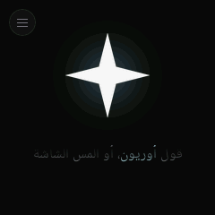 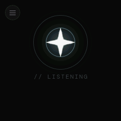 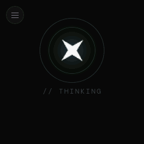 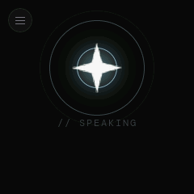 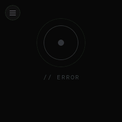 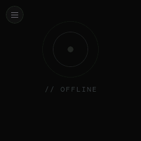

| State | Look |
|---|---|
| boot | the star, then the Ori*on* wordmark and the tagline rising under it, then the mark folds into the orb: 1.7 s from black |
| idle | the 96 px white star over a glow breathing on the 2.5 s cycle; under it "قول أوريون، أو المس الشاشة" with أوريون in the accent; two link dots |
| wake | the orb flares for 200 ms |
| listening | the 56 px star with three accent rings rippling out every 1.0 s; their brightness and reach follow the microphone, and the star swells up to 14 percent with the voice |
| thinking | no rings rippling: the star turns once every 7 s, like an orbit, inside two still rings breathing out of step; leaving thinking it settles on its nearest upright pose |
| speaking | ripples every 1.4 s, brighter and fuller, following Orion's own playback level; the star swells up to 18 percent |
| error | the plain orb, grey, glow off, one knock of 6 px each way and a 400 ms settle |
| offline | the orb at 10 percent white, no glow, the ring fading in and out every 1.8 s |

The star crossfades with the orb and the idle mark on the brand curve, so moving between states bends the motion rather than cutting it. Levels arrive at 33 Hz from the state machine and are smoothed with a fast rise and slow fall, so a syllable lands at once and dies away.

The idle **link dots** are labelled التلفون (phone) and الكمبيوتر (PC). A lit dot glows in the accent while that app holds a live `/ws` link; it dims when the socket closes or after 15 s of silence.

Frame rates on the full firmware, measured with `ui perf`:

| State | Average fps |
|---|---|
| idle | 30 (28 minimum; the breathing glow redraws under the mark every frame) |
| wake | 35 |
| listening | 43 |
| thinking | 45 |
| speaking | 40 |

## Text

`ui_text.c`. What the user said, then Orion's reply, in a fixed 216 x 72 box that nothing can draw outside of.

- Two lines of 22 px Naskh fit exactly. Longer text scrolls inside the box at 70 ms a character (2 to 20 s in all), with 20 px fades at the top and bottom edges so a line never ends on a hard cut. Short text is centred.
- The first strong character decides the direction: Arabic hangs from the right edge, English from the left. LVGL still reorders mixed runs inside each line, so "فتحتلك الـ Spotify على الـ PC." reads correctly.
- `ui_set_text` strips every `[...]` span first, folds the spaces, keeps no space before a stop and trims, so emotion tags meant for the voice never reach the glass, whoever calls it. An unclosed `[` is kept as text.

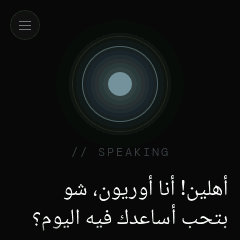 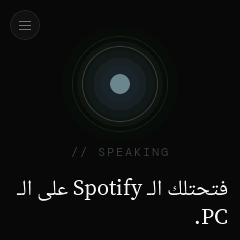 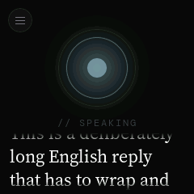 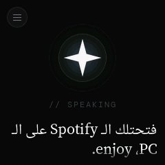

## The menu

`ui_menu.c`. Full screen, title الإعدادات, a close button where the menu button was (so the corner reads as a toggle), and a scrolling column of cards. It closes itself after 20 s without a touch.

| Card | Rows | Button |
|---|---|---|
| `// PC` الكمبيوتر | state (ما في جهاز none, موجود found, متصل connected in the accent), name, IP | تحديث: check the PC brain now |
| `// NET` الشبكة | signal as bars and dBm (or مافي إنترنت), SSID, IP | إعداد الواي فاي: restart into Bluetooth setup mode |
| `// CAM` الكاميرا | a live preview | |
| `// RESET` إعادة ضبط | "erases the network, the keys and the devices, and goes back to first setup" | امسح كل شي, then "متأكد؟ اضغط كمان" (sure? press again) for 4 s |

Each value row picks its own text direction from its content; with the whole row right to left, "-58 dBm" had its minus on the wrong side.

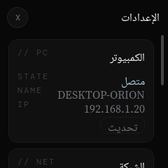 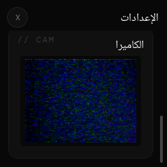

### The camera preview

`ui_cam.c`. While the menu is open, a capture task (PSRAM stack) asks the camera for 160x120 RGB565 frames and copies each into one of two PSRAM slots; a 30 ms LVGL timer swaps them in without blocking. The camera's own buffer is released straight after the copy, so the sensor never waits on the screen. Measured: 222 frames in 20 s, **11.1 fps**, against the sensor's own 12.5.

- The OV2640 sends RGB565 high byte first. This LVGL build cannot draw the byte-swapped format (it silently draws nothing), so the bytes are swapped in the copy.
- If only a JPEG source is set, the card falls back to decoding 320x240 JPEGs with TJpgDec, about 120 ms a frame, shown at 1:1 and cropped to the middle. TJpgDec needs `CONFIG_LV_USE_FS_MEMFS` to read a JPEG from memory, and the width and height are parsed from the SOF marker by hand.
- The first version captured inside an LVGL timer, and a 640x480 capture froze the whole screen for its duration.

## Setup and pairing screens

**Bluetooth setup** (`ui_setup.c`), over everything, swallowing taps: `// BLUETOOTH SETUP`, "شغّل البلوتوث على تلفونك" (turn Bluetooth on on your phone), "وافتح تطبيق أوريون واختار" (open the Orion app and choose), the board's name in the accent, and the six digit code in Playfair at 40 px, grouped `482 913` the way it is read aloud. At the bottom a status with a live dot:

| Status | Text | Dot |
|---|---|---|
| waiting | بستنى التلفون عالبلوتوث | pulsing |
| connecting | عم بتصل بالشبكة | pulsing |
| failed | ما زبط الاتصال: *reason*, on two lines | dim, still |
| done | تمام، صرت على الشبكة, then the screen hands back after 2.5 s | lit |

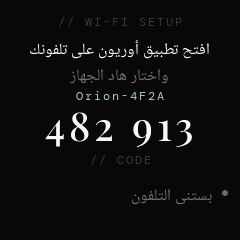 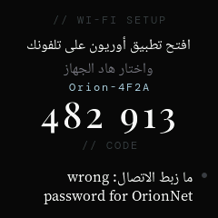

**Pairing with a code** (`ui_pair.c`): the code set large with the seconds left, for an app pairing over the LAN. It goes when the time is up or the app gets it right.

## Driving and seeing it from the console

Nothing here needs a finger or a camera pointed at the glass:

```
ui state listening            # any state by name
ui text <utf8>                # set the text box
ui level 0.6                  # the listening level
ui tap                        # a tap on the glass
ui menu [ip] [rssi] [pc] [conn]    # open the menu with sample values
ui cam [live]                 # the camera card from a test JPEG, or live
ui setup [off]                # the setup screen
ui ar 1|2, ui tags 1|2        # compiled-in Arabic test strings
ui fps, ui perf               # frame rate
ui shot                       # screenshot as base64 RGB565
ui mem                        # LVGL and heap memory
```

The console drops every byte above 0x7F, so Arabic cannot be typed over the wire; that is why the Arabic test strings are compiled in. `ui menu` fills the cards with sample data; restart the board afterwards.

To get a PNG of the screen:

```
python tools/serial_capture.py --no-reset --seconds 8 --send "ui shot" --out shot.txt
python tools/ui_shot.py shot.txt screen.png
```

`ui shot` renders the active screen into a PSRAM buffer on its own task (the console task's stack overflowed doing it) and waits 900 ms first so entrances have finished. Every board screenshot in these docs came from it.
